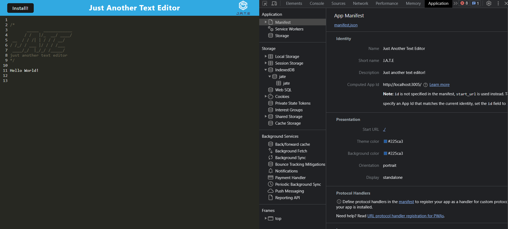

# Text-Editor-PWA

## Description
This challenge is to build a text editor that runs in the browser. The app will be a single-page application that meets the PWA criteria. Additionally, it will feature a number of data persistence techniques that serve as redundancy in case one of the options is not supported by the browser. The application will also function offline.. 

## Usage
To use this application, copy code to system and run npm install. 

## Screenshot

## Heroku Link
https://jate-editor24-21c075ec6935.herokuapp.com/

## Questions
If you have any questions, feel free to reach out to me:

GitHub: gioq89

Email: gioq89@gmail.com
